# Customer Review Multi-Classification Using Python

This project builds a multi-class text classification model that predicts a customer review's **1-to-5-star rating** from its written content. Using 50,000 Amazon camera-product reviews, the notebook covers data inspection, cleaning, exploratory analysis, TF-IDF feature extraction, model comparison, hyperparameter tuning, class-level evaluation, interpretation, and model deployment.

---

## Project Overview

The objective is to classify customer reviews into five rating classes using natural language processing and classical machine learning. The review headline and review body are combined into one text feature, transformed with TF-IDF, and evaluated across five classifiers:

- Multinomial Naive Bayes
- Logistic Regression
- Linear Support Vector Machine (`LinearSVC`)
- Random Forest
- XGBoost

Because the rating distribution is heavily concentrated in the 5-star class, the project considers both overall performance and **macro F1-score**, which gives each rating class equal importance. The final model is selected after examining aggregate metrics and per-class performance, particularly on the minority 2-star and 3-star classes.

---

## Business Value

Automatically estimating star ratings from review text can help businesses:

- Monitor customer sentiment across large volumes of feedback.
- Identify dissatisfied customers and recurring product issues more quickly.
- Detect disagreements between written feedback and submitted ratings.
- Compare customer experience across products or product groups.
- Prioritize manual review of ambiguous or potentially mislabeled feedback.
- Build a foundation for review-routing, alerting, and customer-support workflows.

---

## Dataset

The notebook uses the **Amazon US Camera Reviews** dataset stored in:

```text
data/raw/amazon_reviews_us_Camera_v1_00.zip
```

After extraction, the notebook reads:

```text
data/raw/amazon_reviews_us_Camera_v1_00.tsv
```

The analysis loads the first **50,000 reviews**. The source data contains 15 columns, including product identifiers, product titles, star ratings, review headlines, review bodies, vote counts, purchase-verification status, and review dates.

Key dataset observations from the notebook:

- All 50,000 records belong to the `Camera` product category.
- The sample contains 20,900 unique product IDs.
- Eleven rows have a missing `review_body`; these values are replaced with empty strings.
- The modeling features are `review_headline` and `review_body`.
- The target is `star_rating`, with values from 1 to 5.
- The review headline is repeated when combined with the review body to give it additional weight.

### Star-rating distribution

| Star rating | Reviews | Share |
|---:|---:|---:|
| 1 | 4,750 | 9.50% |
| 2 | 2,382 | 4.76% |
| 3 | 3,580 | 7.16% |
| 4 | 7,772 | 15.54% |
| 5 | 31,516 | 63.03% |
| **Total** | **50,000** | **100.00%** |

The strong concentration of 5-star reviews makes this an imbalanced multi-class classification problem.

---

## Repository Structure

```text
Customer_Review_Multi_Classification/
├── data/
│   ├── negstopwords.txt
│   └── raw/
│       └── amazon_reviews_us_Camera_v1_00.zip
├── images/
│   └── *.png                      # Visualizations exported from the notebook
├── models/
│   └── review_rating_model.pkl
├── notebooks/
│   └── customer_review_multi_classification.ipynb
├── .gitattributes
├── .gitignore
├── README.md
└── requirements.txt
```

---

## Methodology

The subsection names and order below follow the workflow used in `notebooks/customer_review_multi_classification.ipynb`.

### Import Libraries & Load Data

The notebook imports the data-processing, visualization, NLP, modeling, tuning, evaluation, and persistence libraries used throughout the project. It then reads the tab-separated Amazon Camera review data and limits the working sample to 50,000 rows.

### Initial Exploratory Data Analysis

The initial inspection reviews the dataframe structure, column data types, missing values, duplicated rows, product category, and number of unique products. This step identifies 11 missing review bodies, no duplicated rows, 50,000 Camera-category records, and 20,900 unique product IDs.

### Data Handling and Cleaning

The raw dataset is reduced to the columns required for text modeling and target prediction.

#### Selecting the column with the features (Review columns)

The notebook selects `review_headline`, `review_body`, and `star_rating`. Unused metadata fields are excluded from the modeling dataframe.

#### Combine `review_headline` with `review_body`

Missing review bodies are replaced with empty strings. A new `review` feature is created by concatenating the review headline twice with the review body:

```python
cleaned_data["review"] = (
    cleaned_data["review_headline"] + " "
    + cleaned_data["review_headline"] + " "
    + cleaned_data["review_body"]
)
```

Repeating the headline intentionally gives the short summary more influence in the resulting text representation.

### Exploratory Data Analysis

The main EDA stage examines class imbalance, rating patterns across products, and frequently occurring terms in the review text.

##### Star Rating Distribution

The rating-frequency analysis shows that 5-star reviews dominate the sample, accounting for 31,516 of the 50,000 observations. Product-level cross-tabulations are also inspected to compare the distribution of ratings across camera products.

<p align="center">
  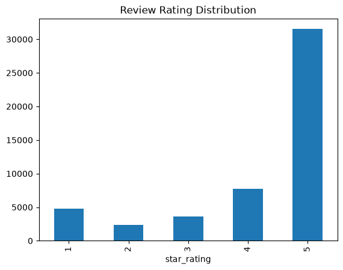
</p>

The distribution is heavily imbalanced (negatively skewed): 5-star reviews far outnumber every other rating, while 2-star and 3-star reviews are the smallest classes.

#### Wordcloud Visualization

Word clouds are used to inspect frequently occurring terms across the full corpus and within different rating groups. This analysis also reveals the repeated token pattern `br br`, which originates from HTML line-break tags.

##### Wordcloud of all the Reviews

The initial all-review word cloud helps identify frequent language and exposes HTML `<br />` artifacts. The notebook finds 5,353 reviews containing these line breaks, removes them, and regenerates the word cloud.

| Before removing HTML line breaks | After removing HTML line breaks |
|:---:|:---:|
| 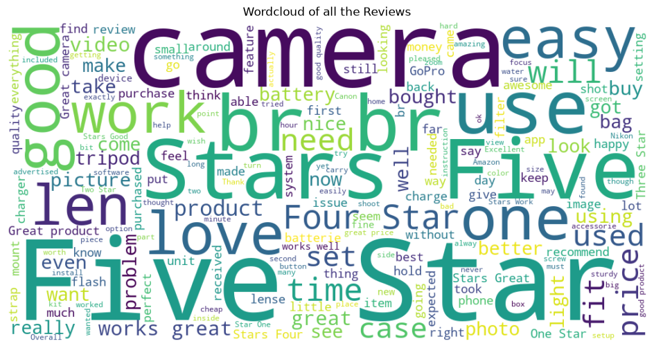 | 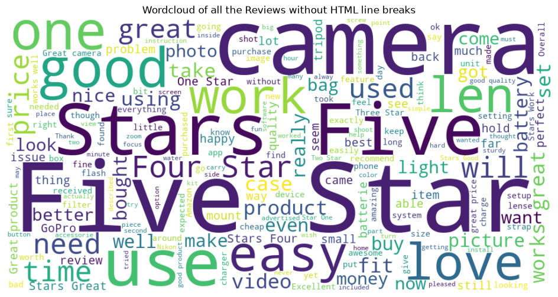 |

After cleaning, "Five Star" is the most prominent phrase, consistent with the dominance of 5-star ratings, and "camera" appears frequently, confirming that the reviews match the product category.

##### Wordcloud of Reviews with 4 or 5 Star Ratings

A separate word cloud is generated for positive reviews with ratings of 4 or 5 stars.

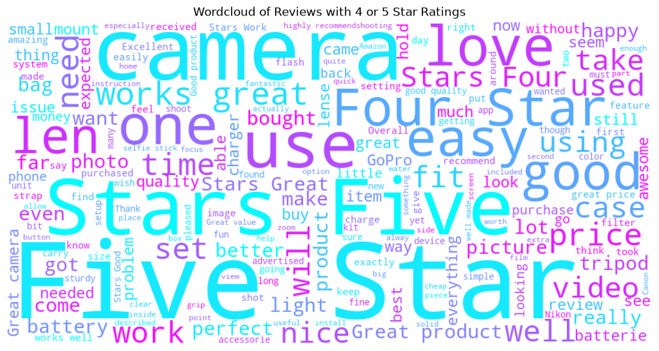

##### Wordcloud of Reviews with 3 Star Ratings

A word cloud is generated for neutral or mixed reviews with a 3-star rating.

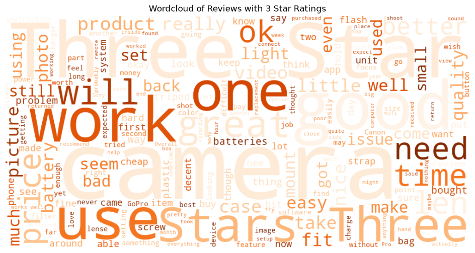

##### Wordcloud of Reviews with 1 or 2 Star Ratings

A separate word cloud is generated for negative reviews with ratings of 1 or 2 stars.

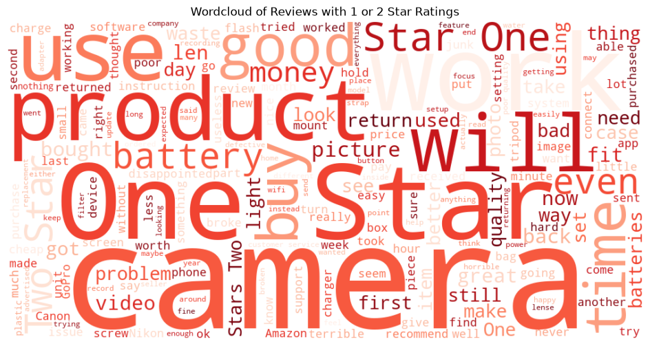

### Data Preprocessing

The `process_message` function prepares text by:

- Converting text to lowercase.
- Expanding contractions with the `contractions` package.
- Removing punctuation.
- Reducing sequences of three or more repeated characters to two characters.
- Removing extra whitespace.

This function is applied to the combined `review` feature and is also passed to `TfidfVectorizer` as its preprocessor.

### Encoding

`LabelEncoder` converts the original star ratings into zero-based labels required by XGBoost:

| Original rating | Encoded class |
|---:|---:|
| 1 star | 0 |
| 2 stars | 1 |
| 3 stars | 2 |
| 4 stars | 3 |
| 5 stars | 4 |

### Train Test Split

The processed data is divided into training and test sets using an 80/20 split with `random_state=42`. Stratification preserves the original class proportions, producing 40,000 training reviews and 10,000 test reviews.

### Feature Extraction

Text is converted into numerical features using `TfidfVectorizer` with the following initial configuration:

```python
TfidfVectorizer(
    preprocessor=process_message,
    max_features=30000,
    ngram_range=(1, 2),
    min_df=5,
    max_df=0.9,
    sublinear_tf=True,
    norm="l2",
    dtype=np.float32
)
```

The vectorizer captures unigrams and bigrams, limits the feature space, filters very rare and overly common terms, applies sublinear term frequency, and uses L2 normalization.

### Model Pipeline and Evaluation

Each classifier is combined with TF-IDF in a scikit-learn `Pipeline`, ensuring that feature extraction and model fitting remain part of one reproducible workflow.

#### Creating Evaluation Metrics Function

The notebook defines `evaluate_preds` to calculate:

- Accuracy
- Weighted precision
- Weighted recall
- Weighted F1-score
- Macro F1-score

#### Baseline Model - Multinomial Naive Bayes

A `MultinomialNB` pipeline provides the baseline for the multi-class text-classification task.

#### Logistic Regression

A `LogisticRegression` pipeline is trained and evaluated using the same TF-IDF representation.

#### Support Vector Machine (SVM)

A linear support vector classifier is evaluated through `LinearSVC`, which is well suited to high-dimensional sparse text features.

#### Random Forest

A `RandomForestClassifier` pipeline is trained as a nonlinear ensemble benchmark.

#### XGBoost

An `XGBClassifier` pipeline is trained after encoding the rating labels as classes 0 through 4.

#### Performance Evaluation

The baseline models are compared using the five metrics produced by `evaluate_preds`. Logistic Regression records the highest baseline accuracy, while Logistic Regression and LinearSVC share the highest rounded macro F1-score.

### Hyperparameter Tuning and Optimization

The notebook tunes TF-IDF and classifier hyperparameters using 5-fold cross-validation with macro F1 as the scoring metric. `GridSearchCV` is used for Multinomial Naive Bayes, Logistic Regression, LinearSVC, and Random Forest; `RandomizedSearchCV` is used for XGBoost.

#### Baseline Model - Multinomial Naive Bayes

The search tunes `alpha` together with TF-IDF n-gram range, document-frequency thresholds, and maximum feature count.

#### Logistic Regression

The search evaluates regularization strength (`C`), class weighting, solver choice, and TF-IDF settings. The selected Logistic Regression configuration uses `C=5`, no class weighting, the `lbfgs` solver, 20,000 maximum TF-IDF features, `min_df=3`, `max_df=0.9`, and unigrams plus bigrams.

#### Support Vector Machine

The LinearSVC search evaluates `C`, class weighting, and TF-IDF settings. The selected configuration uses `C=0.1`, balanced class weights, 30,000 maximum features, `min_df=5`, `max_df=0.9`, and unigrams plus bigrams.

#### Random Forest

The search evaluates the number of trees, maximum depth, class weighting, minimum document frequency, and maximum feature count.

#### XGBoost

Randomized search evaluates the number of estimators, learning rate, tree depth, minimum child weight, row subsampling, column subsampling, minimum document frequency, and maximum TF-IDF feature count.

#### Performance Evaluation

The tuned models are compared using accuracy, weighted precision, weighted recall, weighted F1-score, and macro F1-score. Logistic Regression, LinearSVC, and XGBoost all achieve a rounded macro F1-score of 0.65, while the unrounded and class-level results guide the final model choice.

##### Per Class Performance Evaluation

The two leading linear models are examined with full classification reports to measure performance for each encoded rating class rather than relying only on aggregate metrics.

###### Logistic Regression

The tuned Logistic Regression model achieves 81.23% test accuracy and a macro F1-score of approximately 0.655. Its F1-scores for the original 2-star and 3-star classes are approximately 0.467 and 0.533, respectively.

###### Support Vector Machine

The tuned LinearSVC model achieves 80.87% test accuracy and a macro F1-score of approximately 0.651. Its F1-scores for the original 2-star and 3-star classes are approximately 0.445 and 0.522, respectively.

##### Visualisations

The notebook visualizes:

- Accuracy, precision, recall, and F1-score for all tuned models.
- Weighted F1-score versus macro F1-score for the tuned models.
- Per-class F1-scores for Logistic Regression and LinearSVC.
- The Logistic Regression confusion matrix in counts and row-normalized percentages.
- The terms with the strongest Logistic Regression coefficients for each rating class.
- The strongest positive and negative term impacts for the lowest and highest rating classes.

###### Performance Comparison of Tuned Models

All five tuned models land in a narrow band of roughly 0.78–0.81 across the weighted metrics.

<p align="center">
  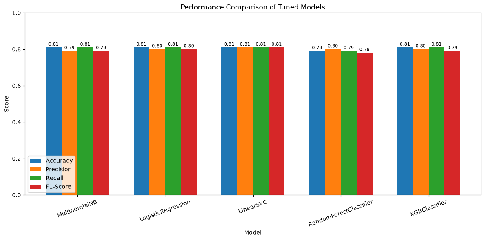
</p>

###### F1-Score vs Macro F1-Score

The gap between weighted F1 and macro F1 shows how much the class imbalance affects each model: weighted F1 is carried by the large 5-star class, while macro F1 exposes weaker performance on the minority classes.

<p align="center">
  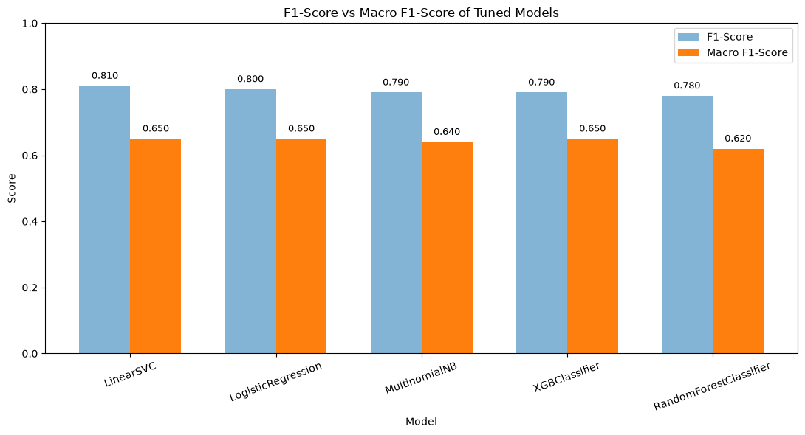
</p>

###### Per-Class F1-Score: Logistic Regression vs LinearSVC

Both models score highest on the 1-star and 5-star classes and drop sharply on the 2-star and 3-star classes. Logistic Regression is slightly ahead on these minority classes.

<p align="center">
  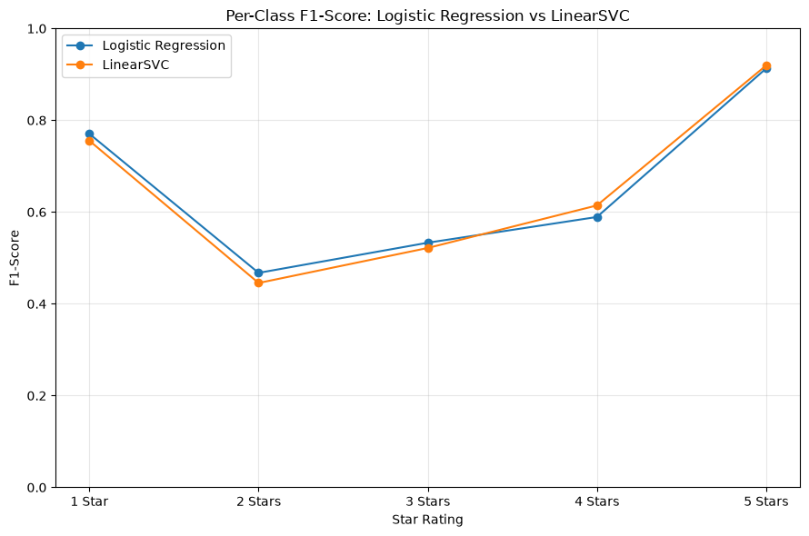
</p>

###### Confusion Matrix - Logistic Regression

| Counts | Row-normalized (%) |
|:---:|:---:|
| 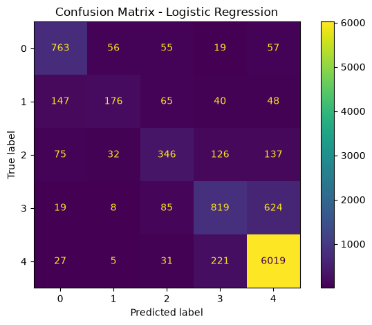 | 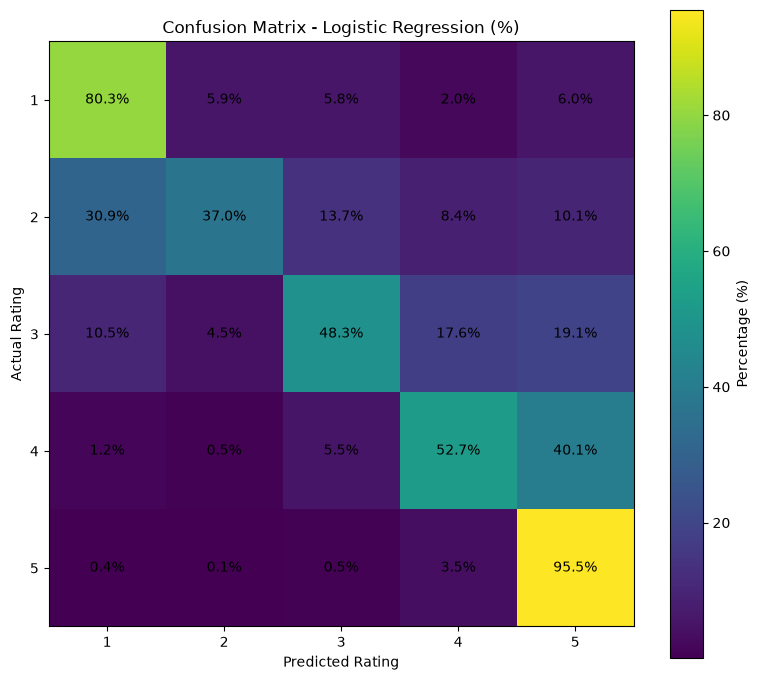 |

The model correctly classifies 95.5% of 5-star and 80.3% of 1-star reviews. Errors mostly fall on neighbouring ratings: 30.9% of 2-star reviews are predicted as 1-star, and 40.1% of 4-star reviews are predicted as 5-star.

###### Top Terms per Rating Class (Logistic Regression)

The ten terms with the highest coefficients for each class (encoded class 0 = 1 star, …, 4 = 5 stars):

| Rank | 1 star | 2 stars | 3 stars | 4 stars | 5 stars |
|---:|---|---|---|---|---|
| 1 | one star | two stars | three stars | four stars | great |
| 2 | not | not | ok | four | five stars |
| 3 | useless | stars two | three | great | perfect |
| 4 | terrible | poor | but | good | five |
| 5 | star one | useless | stars three | stars four | love |
| 6 | crap | not great | however | bit | awesome |
| 7 | junk | disappointed | okay | little | excellent |
| 8 | not buy | but the | otherwise | so far | stars five |
| 9 | worthless | not worth | like my | not bad | amazing |
| 10 | star | not good | not great | stars is | perfectly |

###### Top Word Impacts for the Most Negative and Most Positive Classes

Green bars are terms that push a review toward the class, and red bars are terms that push it away.

| 1 star (class 0) | 5 stars (class 4) |
|:---:|:---:|
| 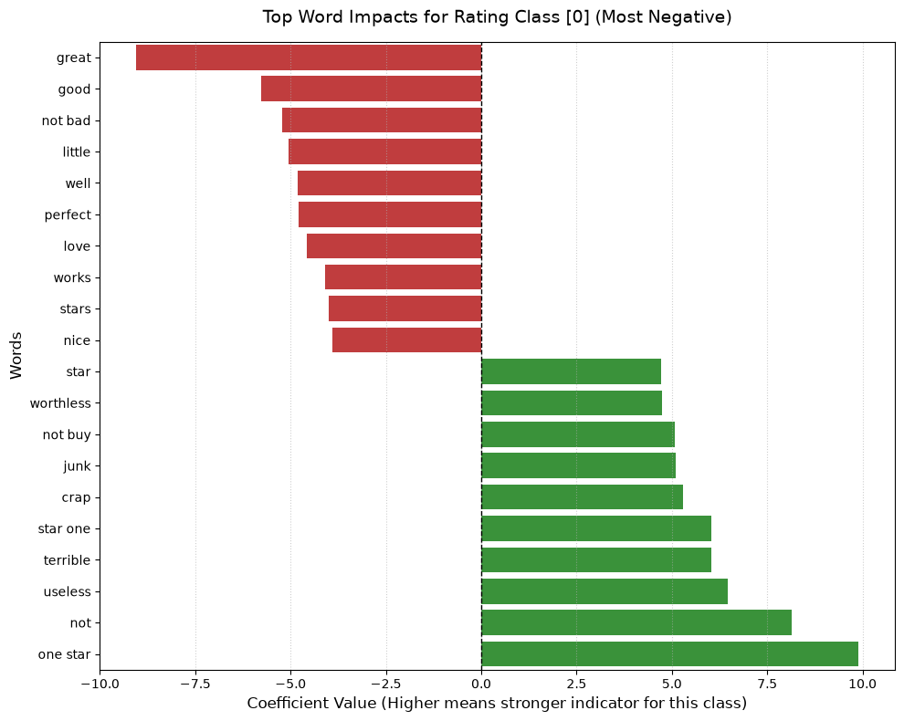 | 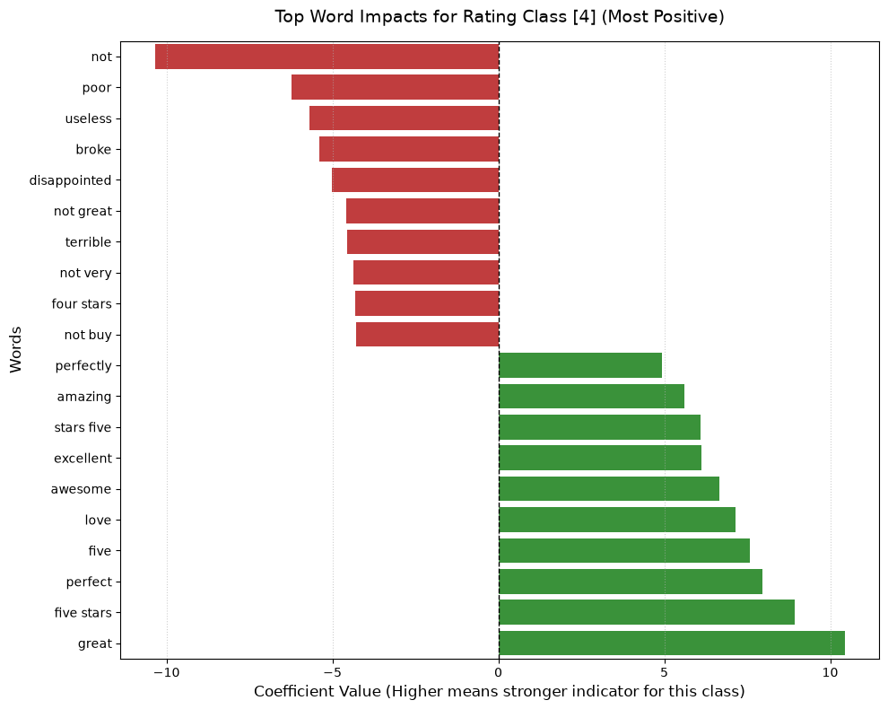 |

### Conclusion

Logistic Regression is selected as the final model. It produces the highest unrounded macro F1-score and accuracy among the tuned candidates and performs slightly better than LinearSVC on the minority 2-star and 3-star classes.

### Deployment

The deployment stage prepares the selected end-to-end pipeline for reuse. Because the pipeline includes both TF-IDF transformation and classification, new raw review text can be passed directly to the saved model.

#### Saving the Model

The selected Logistic Regression pipeline is serialized with `joblib` to:

```text
models/review_rating_model.pkl
```

---

## Results Summary

### Baseline models

| Model | Accuracy | Precision | Recall | F1-score | Macro F1-score |
|---|---:|---:|---:|---:|---:|
| Multinomial Naive Bayes | 0.78 | 0.80 | 0.78 | 0.75 | 0.58 |
| Logistic Regression | **0.82** | 0.81 | **0.82** | **0.80** | **0.65** |
| LinearSVC | 0.81 | 0.80 | 0.81 | **0.80** | **0.65** |
| Random Forest | 0.77 | **0.81** | 0.77 | 0.74 | 0.58 |
| XGBoost | 0.81 | 0.79 | 0.81 | 0.79 | 0.64 |

### Tuned models

| Model | Accuracy | Precision | Recall | F1-score | Macro F1-score |
|---|---:|---:|---:|---:|---:|
| Multinomial Naive Bayes | 0.81 | 0.79 | 0.81 | 0.79 | 0.64 |
| Logistic Regression | **0.81** | 0.80 | **0.81** | 0.80 | **0.65** |
| LinearSVC | **0.81** | **0.81** | **0.81** | **0.81** | **0.65** |
| Random Forest | 0.79 | 0.80 | 0.79 | 0.78 | 0.62 |
| XGBoost | **0.81** | 0.80 | **0.81** | 0.79 | **0.65** |

> The table reports the rounded metrics displayed in the notebook. Model selection also considers the unrounded values and per-class classification reports.

The selected Logistic Regression model achieves:

- Test accuracy: **81.23%**
- Weighted precision: **0.798**
- Weighted recall: **0.812**
- Weighted F1-score: **0.801**
- Macro F1-score: **0.655**

Performance is strongest on the original 1-star and 5-star classes. The 2-star and 3-star minority classes remain more difficult, which is expected given their lower representation and more ambiguous language.

---

## How to Run

### 1. Environment Setup

Clone the repository and enter the project directory:

```bash
git clone https://github.com/arigourumsah/Customer_Review_Multi_Classification.git
cd Customer_Review_Multi_Classification
```

Create and activate a virtual environment:

```bash
python -m venv .venv
```

On macOS or Linux:

```bash
source .venv/bin/activate
```

On Windows PowerShell:

```powershell
.venv\Scripts\Activate.ps1
```

Install the project dependencies and Jupyter:

```bash
python -m pip install --upgrade pip
pip install -r requirements.txt
pip install jupyterlab
```

Extract the dataset archive so the notebook can access the expected TSV file:

```text
data/raw/amazon_reviews_us_Camera_v1_00.tsv
```

### 2. Run the Notebook

Start Jupyter from the repository root:

```bash
jupyter lab
```

Open:

```text
notebooks/customer_review_multi_classification.ipynb
```

Run the cells from top to bottom. The notebook uses paths relative to the `notebooks/` directory and saves the selected pipeline to `models/review_rating_model.pkl`.

---

## Possible Extensions

- Add lemmatization and explicit emoji handling to the preprocessing and tuning workflow.
- Evaluate transformer-based models such as DistilBERT or RoBERTa.
- Remove explicit rating phrases such as “five stars” to test performance without direct label leakage.

